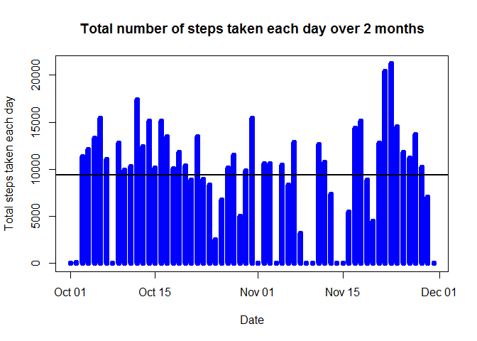
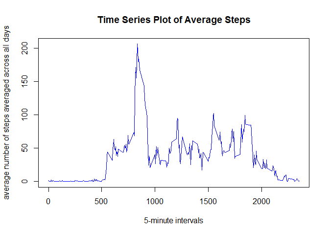
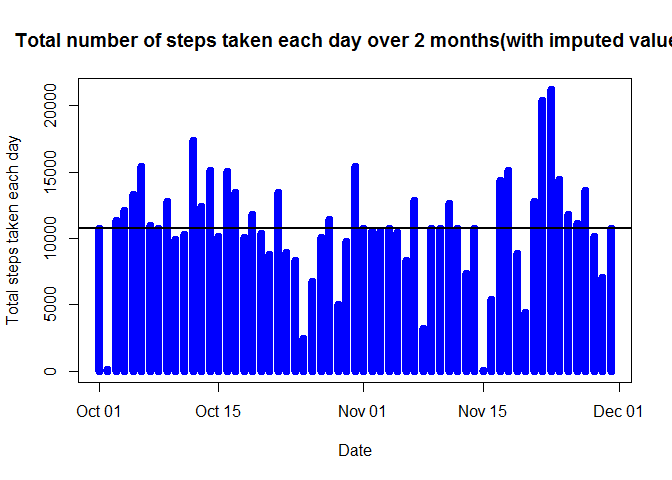
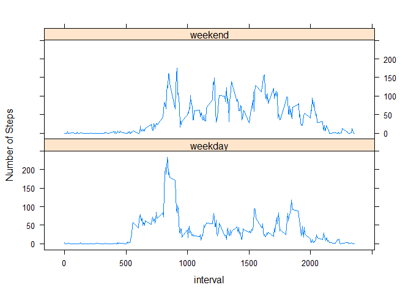

# Reproducible Research: Peer Assessment 1


## Loading and preprocessing the data

```r
library(reshape2)
library(dplyr)
```

```
## 
## Attaching package: 'dplyr'
```

```
## The following objects are masked from 'package:stats':
## 
##     filter, lag
```

```
## The following objects are masked from 'package:base':
## 
##     intersect, setdiff, setequal, union
```

```r
library(lattice)
fileurl <- "https://d396qusza40orc.cloudfront.net/repdata%2Fdata%2Factivity.zip"
download.file(fileurl, destfile = "./activity.zip")
unzip("activity.zip")
activity <- read.csv("./activity.csv")
act_dat <- activity
act_dat[is.na(act_dat)] <- 0
act_dat$date <- as.Date(as.character(act_dat$date))
```


## What is mean total number of steps taken per day?

```r
total_steps <- aggregate(steps ~ date, act_dat, sum)
plot(total_steps$date, total_steps$steps, type="h", main="Total number of steps taken each day over 2 months", xlab="Date", ylab="Total steps taken each day", col="blue", lwd=8)
abline(h=mean(total_steps$steps, na.rm=TRUE), col="black", lwd=2)
```

<!-- -->

```r
Mean_steps <- mean(total_steps$steps)
```


## What is the average daily activity pattern?

```r
act_data <- activity[!is.na(activity$steps),]
avg_steps <- aggregate(steps ~ interval, act_data, mean)
plot(avg_steps$interval, avg_steps$steps, type = "l", col = "blue", xlab = "5-minute intervals", ylab = "average number of steps averaged across all days", main = "Time Series Plot of Average Steps")
```

<!-- -->

```r
max_interval <- avg_steps[which.max(avg_steps$steps),]
```

## Imputing missing values

```r
num_NA <- sum(is.na(activity))
act_melt <- melt(activity, id.vars=c("interval", "date"), measure.vars="steps")
act_impute = transform(act_melt, steps = ifelse(is.na(value), avg_steps$steps, value))
act_impute$date <- as.Date(as.character(act_impute$date))
total_steps_impute <- aggregate(steps ~ date, act_impute, sum)
plot(total_steps_impute$date, total_steps_impute$steps, type="h", main="Total number of steps taken each day over 2 months(with imputed values)", xlab="Date", ylab="Total steps taken each day", col="blue", lwd=8)
abline(h=mean(total_steps_impute$steps), col="black", lwd=2)
```

<!-- -->

```r
Mean_steps <- mean(total_steps_impute$steps)
```

## Are there differences in activity patterns between weekdays and weekends?

```r
activity <- activity[!is.na(activity$steps),]
activity$date <- as.Date(as.character(activity$date))
activity_weekday <- mutate(activity, dayofweek = weekdays(activity$date))
weekday <- c("Monday", "Tuesday", "Wednesday", "Thursday", "Friday")
weekend <- c("Saturday", "Sunday")
for (i in seq_along(activity_weekday$dayofweek)){
    if( activity_weekday$dayofweek[i] %in% weekday){
        activity_weekday$dayofweek[i] <- "weekday"
    } else if (activity_weekday$dayofweek[i] %in% weekend){
        activity_weekday$dayofweek[i] <- "weekend"
    }
}
avg_steps_imputed <- aggregate(steps ~ interval + dayofweek, data=activity_weekday, mean)
xyplot(steps ~ interval | dayofweek, data = avg_steps_imputed, type = "l", layout = c(1,2), ylab = "Number of Steps")
```

<!-- -->
